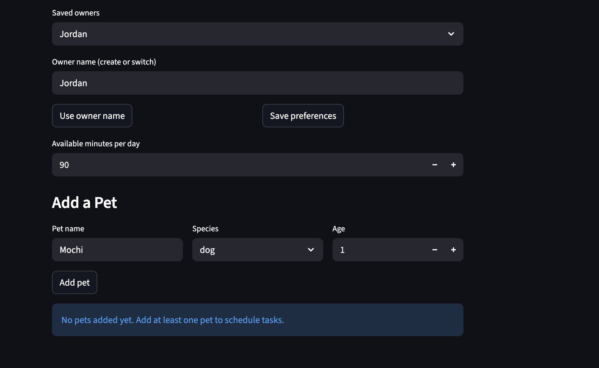

# PawPal+ (Module 2 Project)

You are building **PawPal+**, a Streamlit app that helps a pet owner plan care tasks for their pet.

## Project structure

```text
.
├── assets/                    # Visual assets (versioned with the repo)
│   ├── architecture/         # UML and system / domain diagrams
│   └── screenshots/          # App screenshots and demos
├── docs/                      # Design notes, UML source, reflection
│   ├── Mermaid.txt           # Mermaid diagram source
│   └── reflection.md
├── pawpal/                    # Core Python package
│   ├── __init__.py
│   └── system.py             # CareTask, Pet, Owner, Scheduler
├── tests/
│   └── test_pawpal.py
├── app.py                    # Streamlit entry point
├── main.py                   # Example data and CLI-style usage
├── requirements.txt
└── README.md
```

## Scenario

A busy pet owner needs help staying consistent with pet care. They want an assistant that can:

- Track pet care tasks (walks, feeding, meds, enrichment, grooming, etc.)
- Consider constraints (time available, priority, owner preferences)
- Produce a daily plan and explain why it chose that plan

Your job is to design the system first (UML), then implement the logic in Python, then connect it to the Streamlit UI.

## What you will build

Your final app should:

- Let a user enter basic owner + pet info
- Let a user add/edit tasks (duration + priority at minimum)
- Generate a daily schedule/plan based on constraints and priorities
- Display the plan clearly (and ideally explain the reasoning)
- Include tests for the most important scheduling behaviors

## Features

- Daily schedule generation: builds a plan across all pets while respecting the owner's available minutes per day.
- Time-first sorting: orders tasks by HH:MM start time, then by priority, duration, and title for stable output.
- Pet and status filtering: supports targeted views by pet name and task status (`due`, `incomplete`, `completed`).
- Recurrence expansion: includes only tasks due on the selected date, with support for `none`, `daily`, and `weekly` recurrence.
- Completion rollover for recurring tasks: completing a daily or weekly task automatically creates the next scheduled instance.
- Conflict detection: flags overlapping timed tasks based on start time and duration.
- Conflict-aware planning: removes overlapping timed tasks while preserving schedule order for remaining tasks.
- Plan explanation output: summarizes why tasks were chosen and reports total scheduled minutes.

## Architecture and demo assets

- **UML / system diagram:** `assets/architecture/uml_final.png`
- **App screenshot (demo):** `assets/screenshots/pawpalplus.png`

## Demo



## Getting started

### Setup

```bash
python -m venv .venv
source .venv/bin/activate  # Windows: .venv\Scripts\activate
pip install -r requirements.txt
```

### Run the app

From the project root (so the `pawpal` package resolves correctly):

```bash
streamlit run app.py
```

### Run tests

```bash
python -m pytest
```

### Suggested workflow

1. Read the scenario carefully and identify requirements and edge cases.
2. Draft a UML diagram (classes, attributes, methods, relationships); store exports under `assets/architecture/` and source in `docs/` as needed.
3. Convert UML into Python class stubs in `pawpal/system.py` (no logic yet).
4. Implement scheduling logic in small increments.
5. Add tests in `tests/` to verify key behaviors.
6. Connect your logic to the Streamlit UI in `app.py`.
7. Refine UML so it matches what you actually built.
